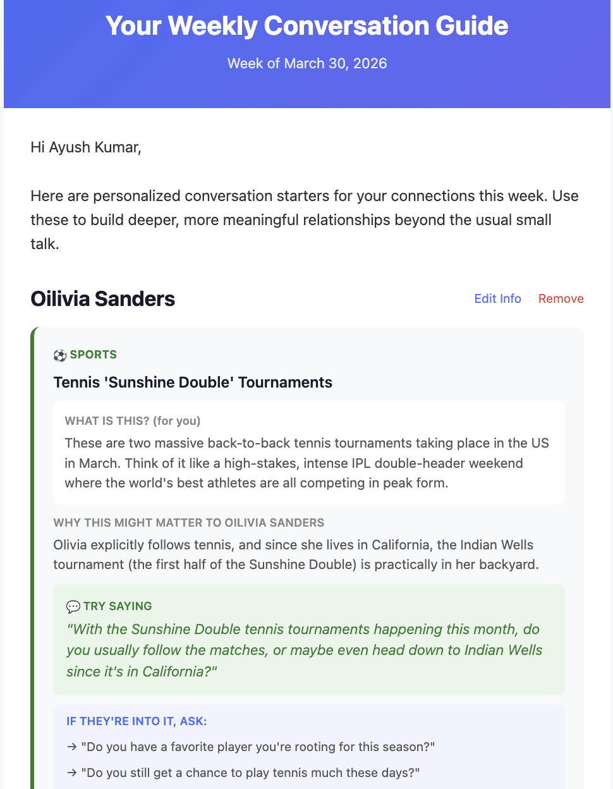

<div align="center">

# Water Cooler

### Build Deeper Relationships with Your Colleagues

Water Cooler sends you personalized, culturally relevant conversation starters about your colleagues — so you always have something meaningful to talk about.



<br/>

### Demo

https://github.com/user-attachments/assets/0c4244ac-a2d7-496d-b994-9ef398dd905c

</div>

---

## The Problem

Work relationships matter, but keeping up with what's happening in your colleagues' worlds is hard. You forget that your teammate is from Chennai and there's a major festival this week. You miss that your manager's favorite cricket team just made the playoffs. Small talk stays small.

Water Cooler fixes this. It monitors real-time events — sports, festivals, food trends, local happenings — and connects them to what it knows about each colleague. Three times a week, you get an email with personalized conversation starters, each explained using **your** cultural background as the reference frame.

---

## 🚀 Quick Start

```bash
git clone https://github.com/pmayushkumar/WaterCooler.git
cd WaterCooler
npm install
cp .env.example .env.local
```

Add your API keys to `.env.local` (all have free tiers):

| Key | Get it from |
|-----|------------|
| `RESEND_API_KEY` | [resend.com](https://resend.com) — 100 emails/day free |
| `GEMINI_API_KEY` | [aistudio.google.com](https://aistudio.google.com/apikey) — 15 req/min free |
| `SERPAPI_KEY` | [serpapi.com](https://serpapi.com) — 100 searches/month free |
| `CRON_SECRET` | Any random string (protects the digest endpoint) |

Then run:

```bash
npm run dev
```

Open **http://localhost:3000**, register, add a colleague, and your first digest arrives within minutes.

> **Tip**: For quick email testing, set `FROM_EMAIL=onboarding@resend.dev` — it delivers to your Resend account email without domain verification.

---

## 🏗 Architecture

```
Next.js (App Router)
├── SQLite (better-sqlite3)     — zero-config, single-file database
├── Resend                      — email delivery
├── Google Gemini               — AI conversation generation
├── SerpAPI                     — real-time event search
└── node-cron                   — digest scheduling (Sun/Tue/Thu 8 PM)
```

**The digest pipeline**: For each user → build search queries per colleague → SerpAPI for real-time events → Gemini generates culturally-bridged conversation starters → HTML email → Resend.

**Three-tier fallback**: SerpAPI fails → Gemini uses profile data only. Gemini fails → basic profile-based starters. Email fails → log error, continue to next user.

---

## 🔧 Make It Your Own

| What | Where |
|------|-------|
| Digest schedule | `DIGEST_SCHEDULE` in `.env.local` (cron expression, default: `0 20 * * 0,2,4`) |
| AI model | `GEMINI_MODEL` in `.env.local` (default: `gemini-2.0-flash`) |
| AI personality & tone | [`src/lib/digest/prompt.ts`](src/lib/digest/prompt.ts) |
| Email design & colors | [`src/lib/email/digest-template.ts`](src/lib/email/digest-template.ts) |
| Connection limit per user | `app_config` table in SQLite (default: 10) |

---

## 🚢 Deployment

**Self-hosted** (recommended): `npm run build && npm start` — handles web app + cron in one process.

**Serverless** (Vercel etc.): Deploy normally, use an external cron to hit `GET /api/digest/cron` with `Authorization: Bearer YOUR_CRON_SECRET`.

---

## 🤝 Contributing

Ideas: alternative email providers (SendGrid, SES), search providers (Brave, Bing), AI models (OpenAI, Claude), Slack/Teams delivery, dark mode UI. PRs welcome.

---

<div align="center">

MIT License · Built by [Ayush Kumar](https://github.com/pmayushkumar)

*Because the best work relationships start with better conversations.*

</div>
